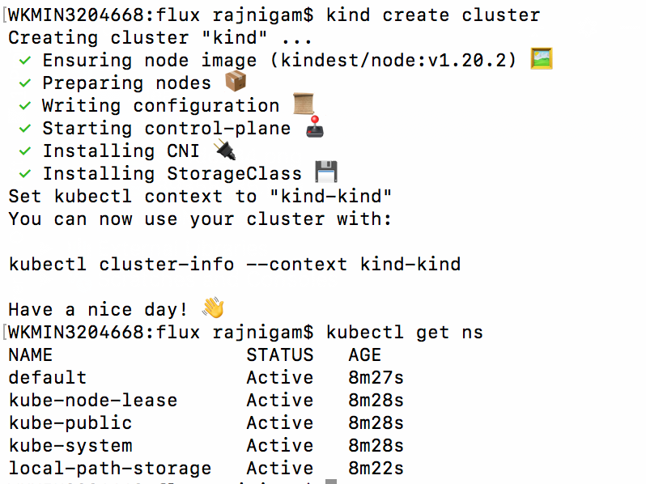
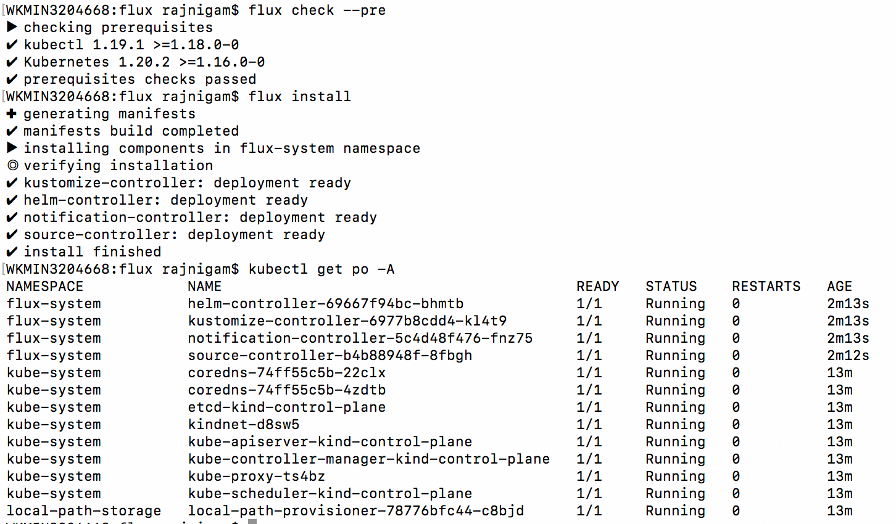
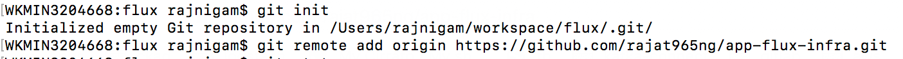
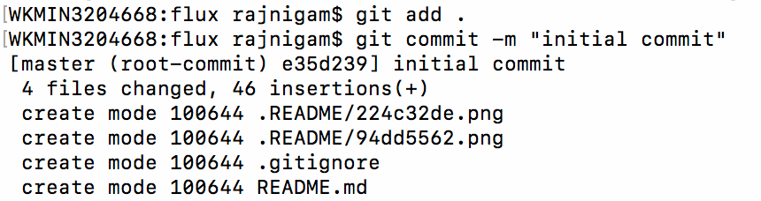
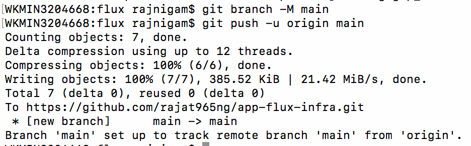
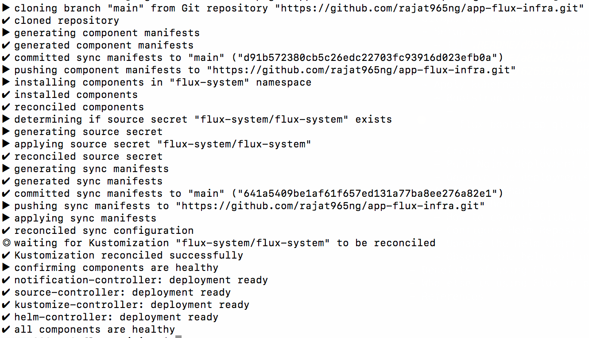

Learn To Implement GitOps On Kubernetes Using Flux In Just 15 Minutes
- Introduction
  - What is GitOps ?
  - What is Flux ?
  - Sidecar Pattern
- System Requirements
  - Setup development cluster using KIND (Kubernetes in docker)
    - ```
        wget https://github.com/kubernetes-sigs/kind/releases/download/v0.10.0/kind-darwin-amd64
        mv kind-darwin-amd64 kind
        chmod +x kind
        mv kind /usr/local/bin/
        kind version
        kind create cluster
        kubectl get ns
      ```
      

  - Install & Configure Flux in Kubernetes Cluster  
    - ```
        wget https://github.com/fluxcd/flux2/releases/download/v0.13.3/flux_0.13.3_darwin_amd64.tar.gz
        tar -xvf flux_0.13.3_darwin_amd64.tar.gz
        mv flux /usr/local/bin/
        flux --version
        flux check --pre
        flux install
      ```
      

- GitOps In Action
  - Setup Git repository "app-flux-infra"
    - 
    - 
    - 
  - Apply kubernetes deployments
    - Bootstrap Git repository in flux
      - ```
        flux bootstrap git app-flux-infra --url=https://github.com/rajat965ng/app-flux-infra.git -u <GIT_USERNAME> -p <GIT_PAT> --token-auth=true --path=./cluster/dev/
        ```
        
    - Create a Nginx deployment
    - Push Nginx deployment in Git repo
    - Observe the deployments rolling
  - Apply Helm Chart
    - Create Helm Chart
    - How to convert Github in Helm repository ?
    - Configure Helm Repository in Flux
    - Update the Helm Chart
    - Observe the helm rolling
- Benefits of using Flux
- Who else is using Flux in production ?
- References