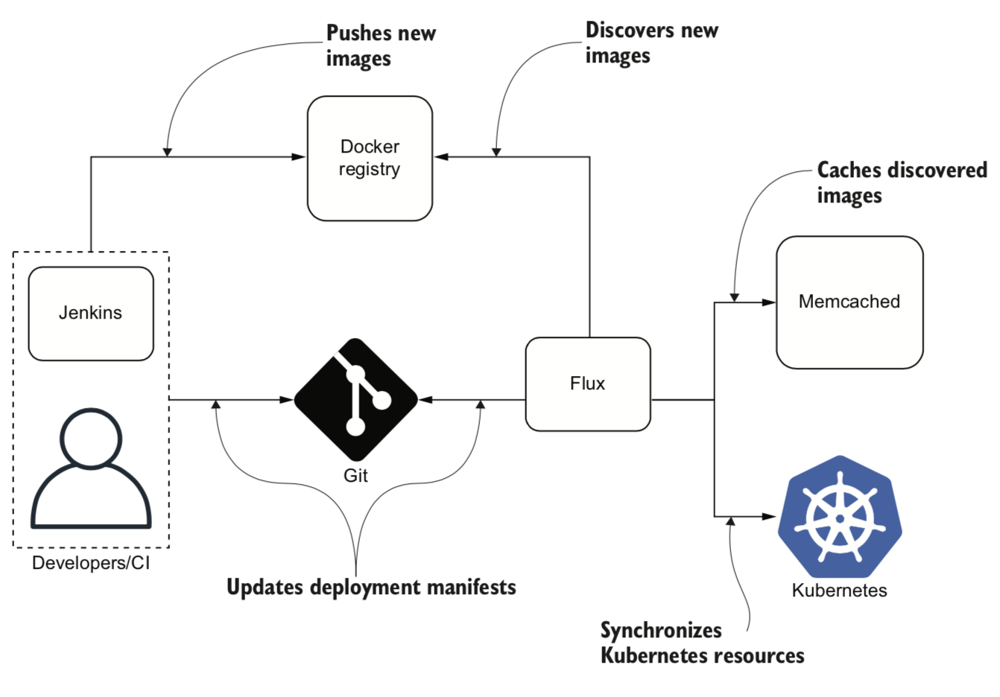

## Table Of Contents
- Introduction
  - What is GitOps?
  - What is Flux?
  - Components Of Flux
- System Requirements
  - Setup development cluster using KIND (Kubernetes in docker)
  - Install & Configure Flux in Kubernetes Cluster
- GitOps In Action
  - Setup Git repository "app-flux-infra"
  - Apply Kubernetes manifests (YAMLs)
    - Bootstrap Git repository in flux
    - Create an Nginx deployment under cluster/dev
    - Observe the deployments rolling on git push and Query Flux to view the currently deployed revision
    - Trace applied revision to match with Git SHA
  - Apply Helm Chart
    - Create a Helm Chart "ms-template"
    - Package Helm Chart
    - How to convert Github repo into Helm repository?
    - Configure Helm Repository in Flux
    - Create Helm Release in Flux
    - Update the Helm Chart
    - Observe the helm update rolling
- Benefits of using Flux
- References 


# Learn To Implement GitOps On Kubernetes Using Flux In Just 15 Minutes
## Introduction
### What is GitOps ?
- The term GitOps was coined in August 2017 in a series of blogs by Alexis Richardson, cofounder and CEO of Weaveworks.
- GitOps is a set of procedures that uses the power of Git to provide both revision and change control within the Kubernetes platform.
- GitOps brings the core benefits of Infrastructure as Code and immutable infrastructure to the deployment, monitoring, and life-cycle management of Kubernetes applications in an intuitive, accessible way.
- A developer-centric experience for managing applications, with fully automated pipelines/workflows using Git for development and operations.
- Use of the Git revision control system to track and approve changes to the infrastructure and run-time environment of applications.


- The GitOps release workflow starts with creating a branch of the repository containing changes to the definition of the system’s desired state.
                                                                                           
### What is Flux ?
- Command line utility for assembling Kubernetes CD pipelines the GitOps way.
- The project was started in 2016 at Weaveworks and joined the CNCF Sandbox three years later.
- Flux does not introduce any additional layers on top of Kubernetes, such as applications or its own access control system. 
- A single Flux instance manages one Kubernetes cluster and requires the user to maintain one Git repository that represents the cluster state.
- Flux typically runs inside of the managed cluster and relies on Kubernetes RBAC. This approach significantly simplifies the Flux configuration and helps flatten the learning curve.
- In the multitenant environment, each team can install an instance of Flux with limited access and use it to manage a single Namespace. That fully empowers the team to manage resources in the application Namespace and is still 100% secure because Flux access is managed by Kubernetes RBAC.

### Flux Architecture
- Flux consists of only two components: 
  - The Flux daemon   
  - The key-value store Memcached (open source, high-performance, distributed memory object-caching system).



- There must be only one replica of the Flux daemon running at any time. Even if the daemon crashes in the middle of a deployment, it restarts quickly and idempotently resumes the deployment process.
- The main purpose of Memcached is to support Docker registry scanning. Flux uses it to store a list of available image versions of each Docker image. 

## System Requirements
### Setup development cluster using KIND (Kubernetes in docker)
   - ```
        wget https://github.com/kubernetes-sigs/kind/releases/download/v0.10.0/kind-darwin-amd64
        mv kind-darwin-amd64 kind
        chmod +x kind
        mv kind /usr/local/bin/
        kind version
        kind create cluster
        kubectl get ns
     ```
      

### Install & Configure Flux in Kubernetes Cluster  
   - ```
        wget https://github.com/fluxcd/flux2/releases/download/v0.13.3/flux_0.13.3_darwin_amd64.tar.gz
        tar -xvf flux_0.13.3_darwin_amd64.tar.gz
        mv flux /usr/local/bin/
        flux --version
        flux check --pre
        flux install
     ```
      

## GitOps In Action
### Setup Git repository "app-flux-infra"
   - 
   - 
   - 
### Apply kubernetes deployments
#### Bootstrap Git repository in flux
   - ```flux bootstrap git app-flux-infra --url=https://github.com/rajat965ng/app-flux-infra.git -u <GIT_USERNAME> -p <GIT_PAT> --token-auth=true --path=./cluster/dev/```
   
     
      
#### Take a git pull and view the cluster hierarchy 
   -   
#### Create a Nginx deployment under cluster/dev
   - 
#### Push Nginx deployment in Git repo
   - 
#### Observe the deployments rolling
   - 
#### Query Flux to view the current deployed revision
   - ```flux get all```
       
     
     
#### Trace applied revision to match with Git SHA
   -     

### Apply Helm Chart
#### Create a Helm Chart "ms-template"

   - 
#### Package Helm Chart
   - To avoid bot crawling on my repository, add the following robots.txt file:
     ```
     echo -e “User-Agent: *\nDisallow: /” > robots.txt
     ```
   - Lint the helm chart
     ```
     helm lint helm-chart/*
     ``` 
   - Package helm chart
     ```
     cd helm-chart/ && helm package ms-template/
     ```   
   - Create index.yaml for ms-template
     ```
     helm repo index --url=https://rajat965ng.github.io/app-flux-infra/helm-chart/ .
     ```  
#### Push Helm Chart in Git

   -  
#### How to convert Github repo in Helm repository ?
   - Click on Git repository "Settings"
   - Scroll down options to choose "Pages"
   - Select "Branch" -> "main" from dropDown and click "save"
   
     
     
#### Configure Helm Repository in Flux
   - ```flux create source helm ms-template --interval=1m -n ms-template --url=https://rajat965ng.github.io/app-flux-infra/helm-chart/```
    
     

#### Create Helm Release in Flux
   - ```flux create hr app --source=HelmRepository/ms-template --chart=ms-template --interval=1m -n ms-template```
   
     

   - ```kubectl get po -n ms-template```
   
     
          
#### Update the Helm Chart
   - Update image tag from "1.16.0" --to--> "1.20.0" in values.yaml and version "0.1.0" --to--> "0.1.1" in Chart.yaml
   - ```
     helm package ms-template/
     helm repo index --url=https://rajat965ng.github.io/app-flux-infra/helm-chart/ .
     ```  
     
     
     
#### Observe the helm rolling

   -  
   
   - Release "0.1.1" is successfully rolled out with updated image tag "v1.20.0"
   
     

## Benefits of using Flux
   - Off-load the hassle of securely managing "kubeconfigs" in CI tools/Vault/buckets etc.
   - The deployment and release process is completely version controlled.
   - Implicit audit provided by Git.
   - Roll-out production release on PR approval.
   - No need to open firewall between CI tool and Kubernetes cluster. Promotes secure CI/CD.
     - Increase confidence in Zero-Trust network implementation.
     - Zero pipeline failures due to network disruption or node failures.
   - Environments achieve its absolute state, as soon Kubernetes cluster recovers from any disaster.
   - Can be combined with Flagger for the automation of promoting canary deployments using Service Mesh like Istio.
   - Extends support with GitHub, GitLab, Harbor etc. with in-built webhooks.
   - Can publish post-release alerts on Slack, MS Teams or SMTP.    


## References
- GitOps and Kubernetes - Continuous Deployment with Argo CD, Jenkins X, and Flux By Billy Yuen, Alexander Matyushentsev, Todd Ekenstam, and Jesse Suen [https://www.manning.com/books/gitops-and-kubernetes]
- KIND [https://kind.sigs.k8s.io/]
- Flux [https://fluxcd.io/]
- Source Code [https://github.com/rajat965ng/app-flux-infra]