# Learn To Implement GitOps On Kubernetes Using Flux In Just 15 Minutes
## Introduction
### What is GitOps ?
### What is Flux ?
### Sidecar Pattern

## System Requirements
### Setup development cluster using KIND (Kubernetes in docker)
   - ```
        wget https://github.com/kubernetes-sigs/kind/releases/download/v0.10.0/kind-darwin-amd64
        mv kind-darwin-amd64 kind
        chmod +x kind
        mv kind /usr/local/bin/
        kind version
        kind create cluster
        kubectl get ns
     ```
      

### Install & Configure Flux in Kubernetes Cluster  
   - ```
        wget https://github.com/fluxcd/flux2/releases/download/v0.13.3/flux_0.13.3_darwin_amd64.tar.gz
        tar -xvf flux_0.13.3_darwin_amd64.tar.gz
        mv flux /usr/local/bin/
        flux --version
        flux check --pre
        flux install
     ```
      

## GitOps In Action
### Setup Git repository "app-flux-infra"
   - 
   - 
   - 
### Apply kubernetes deployments
#### Bootstrap Git repository in flux
   - ```flux bootstrap git app-flux-infra --url=https://github.com/rajat965ng/app-flux-infra.git -u <GIT_USERNAME> -p <GIT_PAT> --token-auth=true --path=./cluster/dev/```
   
     
      
#### Take a git pull and view the cluster hierarchy 
   - 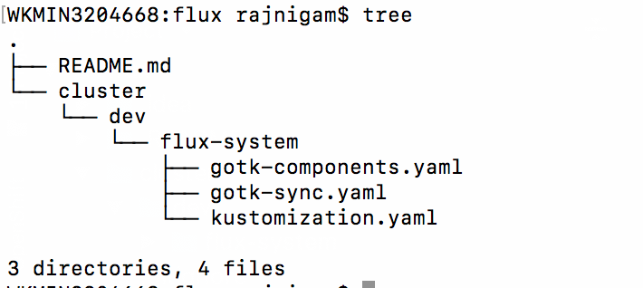  
#### Create a Nginx deployment under cluster/dev
   - 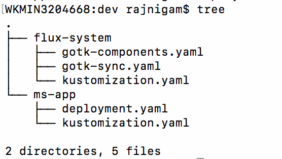
#### Push Nginx deployment in Git repo
   - 
#### Observe the deployments rolling
   - 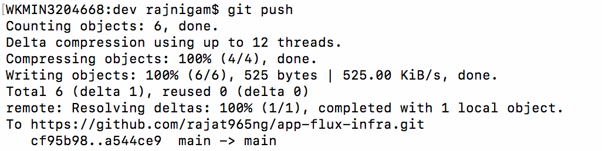
#### Query Flux to view the current deployed revision
   - ```flux get all```
       
     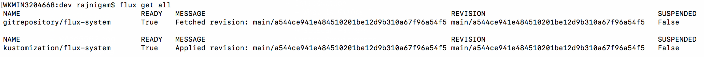
     
#### Trace applied revision to match with Git SHA
   - 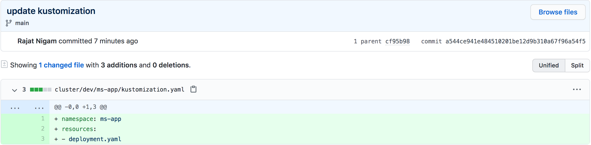    

### Apply Helm Chart
#### Create a Helm Chart "ms-template"

   - 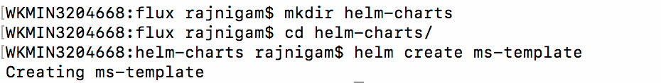
#### Package Helm Chart
   - To avoid bot crawling on my repository, add the following robots.txt file:
     ```
     echo -e “User-Agent: *\nDisallow: /” > robots.txt
     ```
   - Lint the helm chart
     ```
     helm lint helm-chart/*
     ``` 
   - Package helm chart
     ```
     cd helm-chart/ && helm package ms-template/
     ```   
   - Create index.yaml for ms-template
     ```
     helm repo index --url=https://rajat965ng.github.io/app-flux-infra/helm-chart/ .
     ```  
#### Push Helm Chart in Git

   - 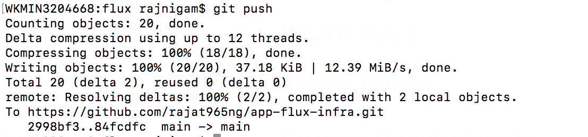 
#### How to convert Github repo in Helm repository ?
   - Click on Git repository "Settings"
   - Scroll down options to choose "Pages"
   - Select "Branch" -> "main" from dropDown and click "save"
   
     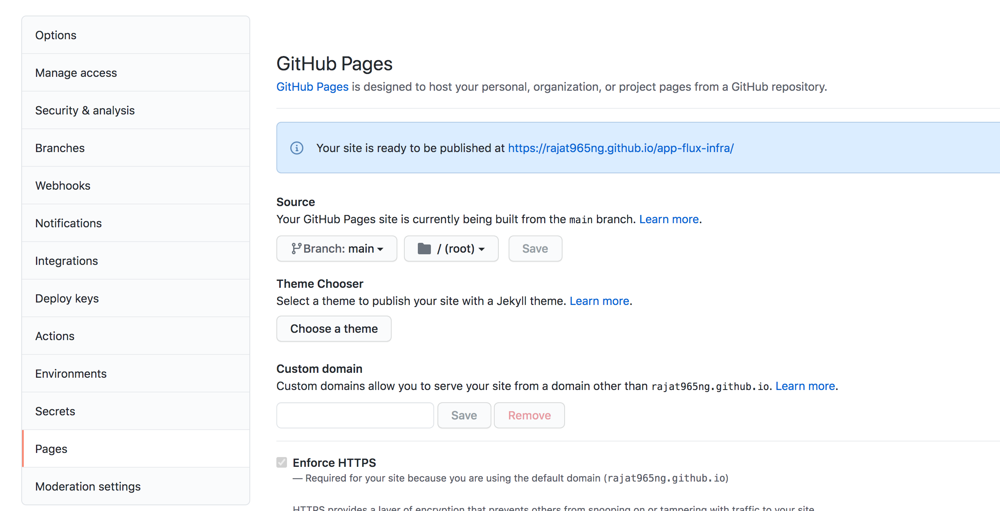
     
#### Configure Helm Repository in Flux
   - ```flux create source helm ms-template --interval=1m -n ms-template --url=https://rajat965ng.github.io/app-flux-infra/helm-chart/```
    
     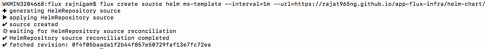

#### Create Helm Release in Flux
   - ```flux create hr app --source=HelmRepository/ms-template --chart=ms-template --interval=1m -n ms-template```
   
     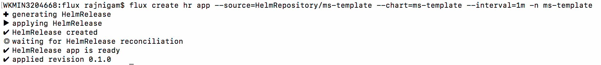

   - ```kubectl get po -n ms-template```
   
     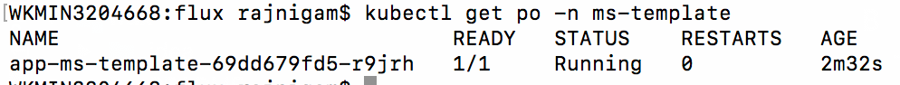
          
#### Update the Helm Chart
   - Update image tag from "1.16.0" --to--> "1.20.0" in values.yaml and version "0.1.0" --to--> "0.1.1" in Chart.yaml
   - ```
     helm package ms-template/
     helm repo index --url=https://rajat965ng.github.io/app-flux-infra/helm-chart/ .
     ```  
     
     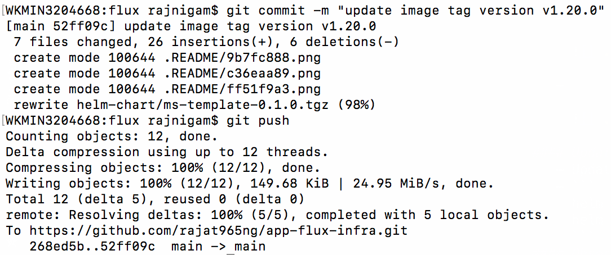
     
#### Observe the helm rolling

   - 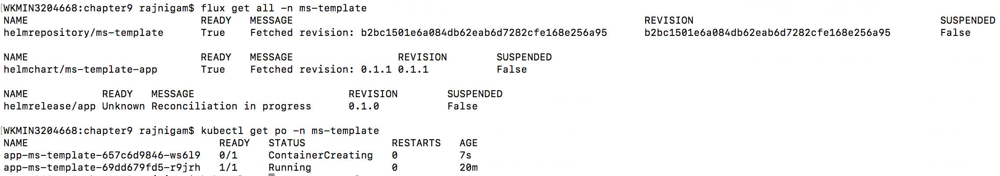 
   
   - Release "0.1.1" is successfully rolled out with updated image tag "v1.20.0"
   
     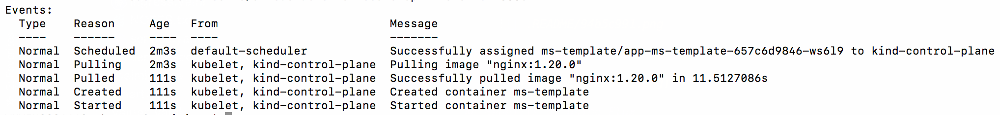

## Benefits of using Flux
## Who else is using Flux in production ?
## References